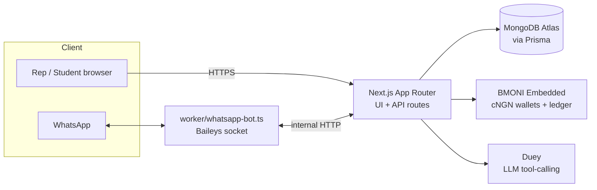

# DueLite

**Pay your dues. See every kobo. No stories.**

Campus dues collection where the money moves on a regulated stablecoin ledger and an AI assistant handles the whole student experience — over WhatsApp.


Built at the **NITHUB Innovation Fair Hackathon 2026**.

---

## The problem

The rep collects ₦500 from 120 people. Cash here, transfer there, a notebook somewhere. By exam week, someone's asking *"where did our money go?"* — and there's no clean answer. Reps get accused. Students get ignored. Trust dies before the semester does.

**DueLite ends the argument — not with promises, with a ledger nobody can edit.**

## How it works

1. **A rep opens a department.** Name it, set the due, get a join code/link. DueLite provisions a dedicated BMONI wallet for the department behind the scenes.
2. **Students join and pay.** Each student gets their own embedded cNGN wallet. Dues move student → department as a regulated, auditable transfer — from the web dashboard or straight from a WhatsApp chat with **Duey**.
3. **Everyone sees the same truth.** The paid list, balances, and every transaction are read live off BMONI's ledger, not typed into DueLite's database. Withdrawals go out through a verified Nigerian bank payout, with a reference to show for it.

## Meet Duey

No dashboard-wahala for students — just text:

| You say | Duey does |
|---|---|
| *"How much do I owe?"* | Pulls every space you've joined and lists unpaid items with amounts |
| *"Pay my dues"* | Previews the amount and your balance, waits for you to say yes, then executes the transfer and sends a receipt |
| *"Did my payment enter?"* | Confirms status against the reconciled ledger record |
| *anything about your department (reps only)* | Totals collected/outstanding, member grid, anomaly flags |

Duey only ever sees names, amounts, statuses, and transaction summaries — never API keys, BVNs, or raw wallet keys.

---

## Architecture



The Next.js app is stateless and serverless-friendly. The WhatsApp connection is not — it's a persistent socket, so it runs as a **separate always-on worker** (`worker/whatsapp-bot.ts`, deployable via `worker/Dockerfile` to Railway/Fly/a VPS) that talks back to the main app over a small internal HTTP endpoint.

## Tech stack

| Layer | Choice |
|---|---|
| Framework | [Next.js](https://nextjs.org) 16 (App Router, API routes, no separate backend) |
| UI | React 19, Tailwind CSS 4, [shadcn](https://ui.shadcn.com)-style components on [Base UI](https://base-ui.com) |
| Database | MongoDB Atlas via [Prisma](https://www.prisma.io) |
| Payment rails | [BMONI](https://bmoni.com) Embedded sandbox — cNGN wallets, KYC, transfers, Nigerian bank payouts |
| Wallet signing | [`viem`](https://viem.sh) (EVM owner keys, EIP-191 signing) |
| WhatsApp | [Baileys](https://github.com/WhiskeySockets/Baileys) multi-device socket, session persisted in Mongo |
| AI | OpenAI-compatible chat completions with tool calling (`lib/duey`) |
| Auth | Cookie session signed with [`jose`](https://github.com/panva/jose) (JWT) |

## Project structure

```
app/
  api/                 REST-ish route handlers (auth, spaces, pay, payout, duey, whatsapp…)
  dashboard/           Rep + student dashboard views
  login/ signup/       Auth pages
lib/
  bmoni.ts             BMONI Embedded API client (provisioning, wallets, transfers, payouts)
  duey/                System prompt, tool definitions, and the run-loop for the AI assistant
  services/            Business logic shared by API routes and Duey's tools
  whatsapp.ts          Outbound bridge to the WhatsApp worker
  reconcile.ts         Matches PAID payments against BMONI's ledger
worker/
  whatsapp-bot.ts      Always-on Baileys process (deploy separately from Vercel)
  mongo-auth-state.ts  Persists the WhatsApp session so restarts skip the QR re-scan
prisma/
  schema.prisma        User, Space, Membership, PaymentItem, Payment, DueyMessage models
scripts/
  provision-test.ts    Exercise the BMONI provisioning flow outside the UI
```

---

## Getting started

### Prerequisites

- Node.js 20+, [pnpm](https://pnpm.io)
- A MongoDB Atlas cluster (replica-set enabled — Prisma needs it for transactions)
- BMONI Embedded sandbox credentials
- A WhatsApp number to link for Duey (optional, only needed for the WhatsApp channel)

### Setup

```bash
pnpm install
cp .env.example .env   # fill in the values below
pnpm db:push            # sync the Prisma schema to MongoDB
pnpm dev                 # http://localhost:3000
```

### Environment variables

| Variable | Purpose |
|---|---|
| `DATABASE_URL` | MongoDB connection string |
| `BMONI_BASE_URL` | BMONI Embedded origin (no `/v1` suffix) |
| `BMONI_API_KEY` | Server-side only — never sent to the browser or the model |
| `KEY_ENCRYPTION_SECRET` | Encrypts each wallet's owner private key at rest |
| `JWT_SECRET` | Signs the session cookie |
| `AI_API_KEY` | Key for Duey's chat completions provider |
| `WHATSAPP_WORKER_URL` / `WHATSAPP_WORKER_SECRET` | Main app ↔ WhatsApp worker internal bridge |
| `ADMIN_SECRET` | Gate for `/admin` |

### Running the WhatsApp worker

```bash
pnpm worker:whatsapp
```

First run prints a QR code — scan it with **WhatsApp → Linked Devices → Link a device**. The session persists to Mongo, so redeploys don't need a re-scan. In production this runs as its own container (`worker/Dockerfile`), since Vercel's serverless functions can't hold a persistent socket.

### Scripts

| Command | Does |
|---|---|
| `pnpm dev` | Start the Next.js dev server |
| `pnpm build` | `prisma generate` + production build |
| `pnpm db:push` | Push `prisma/schema.prisma` to MongoDB |
| `pnpm worker:whatsapp` | Run the always-on Duey WhatsApp bot |
| `pnpm provision:test` | Smoke-test BMONI account provisioning outside the UI |
| `pnpm lint` | ESLint |

---

## Trust model

- Every wallet call happens server-side — the BMONI API key never reaches the browser or the AI model.
- The paid list is **derived from BMONI's ledger**, reconciled against local `Payment` records (`lib/reconcile.ts`), not taken on faith from the database alone.
- Owner keys are encrypted at rest; production would move to on-device signing rather than the custodial demo model used here.
- Duey previews every payment and waits for an explicit confirmation before moving money — never on its own initiative.

## Known limitations

- Custodial wallet keys (hackathon simplification — production would sign on-device)
- No matric/identity verification queue
- Sandbox rails only — test funds, no live NGN settlement
- WhatsApp via an unofficial multi-device socket (Baileys), not the official Meta Business API

---

*Inspired by Duevy, a prior product idea by the author. Built on BMONI's regulated cNGN rails.*
